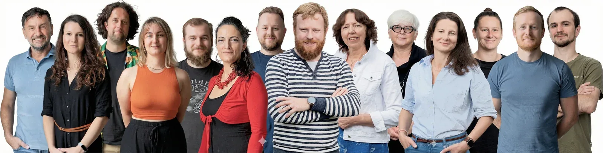

## Chceme mluvit více „po lopatě"

Členové týmu AIS CR s vámi dnes komunikují **osobně** na společných setkáních, cílených školeních a seminářích. Komunikujeme i **elektronicky**, což se děje hlavně v emailech a dále skrze [Zpravodaj AMČR](https://amcr-help.aiscr.cz/zpravodaj/), který podle potřeby přináší novinky ze světa AMČR, a sociální sítě (například [Facebook](https://www.facebook.com/ArcheologickyInformacniSystem)), kde krátkými příspěvky informujeme o tom, co se děje v AIS CR i v **digitálních humanitních vědách** obecně.

Některá témata si ale zaslouží víc prostoru. Chceme se jim podívat **hlouběji pod povrch**, vysvětlit i složitější souvislosti a mluvit srozumitelněji – zkrátka víc „po lopatě". Proto vzniká **Blog AIS CR**, který bude zároveň místem pro šíření kontextu k našim nástrojům a službám a pro rozvoj komunity uživatelů AIS CR.

## Jaké články vás čekají

Blog nebude monotónní – naopak. Budou se v něm střídat různé formáty i autorské hlasy, aby bylo čtení odlehčené i poučné. Příspěvky budou vycházet **několikrát ročně**. Každý článek doplníme stručným shrnutím hlavních bodů a odkazy pro ty, kdo se chtějí ponořit hlouběji do tématu.

Najdete zde **vzdělávací texty**, které přehledně představí **principy, koncepty a pojmy** spjaté s AIS CR – zejména ty, které nemusí být na první pohled zcela jasné.

Zaměříme se také na představení vybraných **sbírek dat (datasetů)** dostupných prostřednictvím našich nástrojů. Ukážeme, jak vznikaly, co obsahují, v jakých formátech jsou k dispozici a jaké jsou možnosti jejich praktického využití.

Nebudou chybět ani **tipy a triky** k využívání AIS CR, které odpovídají na otázky typu **„proč to dělat"** a **„jak to dělat chytře a efektivně"**. Ukážeme například, jak může být užitečné vyplňovat AMČR průběžně, jak zaznamenávat nové lokality objevené na leteckých snímcích nebo jak postupovat při administrativním průchodu terénním výzkumem. Texty doplníme přehlednými infografikami, taháky a konkrétními příklady z praxe.

Nahlédneme také **za oponu fungování infrastruktury** a představíme lidi, kteří za AIS CR stojí. Přiblížíme jejich zapojení do regionálních i mezinárodních projektů a nabídneme drobné exkurze „do kuchyně AIS CR". Chceme ukázat, že za AIS CR nestojí jen databáze a virtuální nástroje, ale především **lidé se znalostmi, zkušenostmi a nadšením** pro kulturní dědictví.  

Příspěvky na Blogu AIS CR budou vycházet buď v češtině, nebo v angličtině, v závislosti na tématu a cílové skupině.

## Shrnutí

Blog AIS CR vzniká proto, aby:

- podpořil rozvoj **dobře informované komunity** uživatelů a uživatelek AIS CR
- šířil vzdělání a dovednosti v oblasti **digitální archeologie**
- vysvětloval **nástroje AIS CR srozumitelně a prakticky**
- ukazoval **příběhy lidí a dat**, které systém tvoří

## Chcete vědět víc?

- Uživatelská dokumentace AMČR, tedy taková "AMČR-wiki": [https://amcr-help.aiscr.cz/](https://amcr-help.aiscr.cz/)
- Zpravodaj AMČR: [https://amcr-help.aiscr.cz/zpravodaj/](https://amcr-help.aiscr.cz/zpravodaj/)
- Facebook AIS CR: [https://www.facebook.com/ArcheologickyInformacniSystem](https://www.facebook.com/ArcheologickyInformacniSystem)
- YouTube AIS CR: [https://www.youtube.com/@aiscr253](https://www.youtube.com/@aiscr253)
    
## AIS CR Blog: Not Just Another News Feed

## Down to Earth and to the Point  

Today, members of the AIS CR team communicate with you primarily **in person** at joint meetings, targeted training sessions, and seminars. We also communicate **digitally**, primarily via email, as well as through the [AMCR Newsletter](https://amcr-help.aiscr.cz/zpravodaj/), which brings news from the AMCR as needed, and on social media (such as [Facebook](https://www.facebook.com/ArcheologickyInformacniSystem)), where we share short updates about what is happening in AIS CR and in the **digital humanities** more broadly.  

Some topics, however, deserve more space. We want to look at them **in greater depth**, dig beneath the surface, explain more complex connections, and communicate more clearly—simply put, more down to earth. That is why the **AIS CR Blog** is being launched. It will serve both as a place to share context around our tools and services and as a platform for fostering the AIS CR user community.

## What Articles Can You Expect?  

This blog is anything but monotonous. Different formats and voices will alternate, keeping the reading both engaging and informative. New posts will appear **several times a year**. Each article will include a short summary of the main points, along with links for those who want to dive deeper into the topic.  

You will find **educational pieces** that clearly introduce **key principles, concepts, and terms** connected to AIS CR – especially those that may not be immediately obvious at first glance.  

There will also be articles presenting selected **datasets** available through our tools. These posts will explore how the datasets were created, what they contain, which formats they come in, and how they can be used in practice.  

**Tips and tricks** for working with AIS CR will be part of the mix as well, addressing questions like *why* something is worth doing and *how* to do it smartly and efficiently. You can expect practical examples such as why it pays off to update the AMCR continuously, how to record new sites identified from aerial imagery, or how to navigate the administrative side of field research. The texts will be accompanied by clear infographics, handy cheat sheets, and real-world examples.  

From time to time, the blog will also take you **behind the scenes of the infrastructure** and introduce the people behind AIS CR. You will get a glimpse into their involvement in regional and international projects and into the “AIS CR kitchen”. The aim is to show that AIS CR is not just about databases and digital tools, but above all about **people – with expertise, experience, and a shared passion** for cultural heritage.  

Posts on the AIS CR Blog will be published either in Czech or in English, depending on the topic and the intended audience.  

## Summary  

The AIS CR Blog is being created to:  

- support the development of a **well-informed community** of AIS CR users
- share knowledge and skills in the field of **digital archaeology**
- explain **AIS CR tools in a clear and practical way**
- highlight the **stories of the people and data** that shape the system

## Want to Learn More?  

- AMCR User Documentation – an “AMCR wiki”: [https://amcr-help.aiscr.cz/](https://amcr-help.aiscr.cz/)  
- AMCR Newsletter: [https://amcr-help.aiscr.cz/zpravodaj/](https://amcr-help.aiscr.cz/zpravodaj/)
- AIS CR on Facebook: [https://www.facebook.com/ArcheologickyInformacniSystem](https://www.facebook.com/ArcheologickyInformacniSystem)
- AIS CR on YouTube: [https://www.youtube.com/@aiscr253](https://www.youtube.com/@aiscr253)
