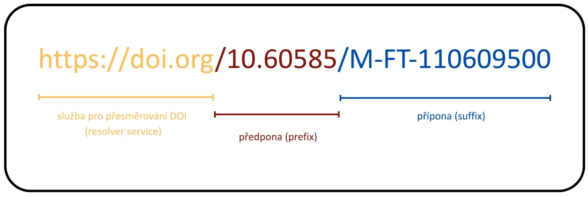
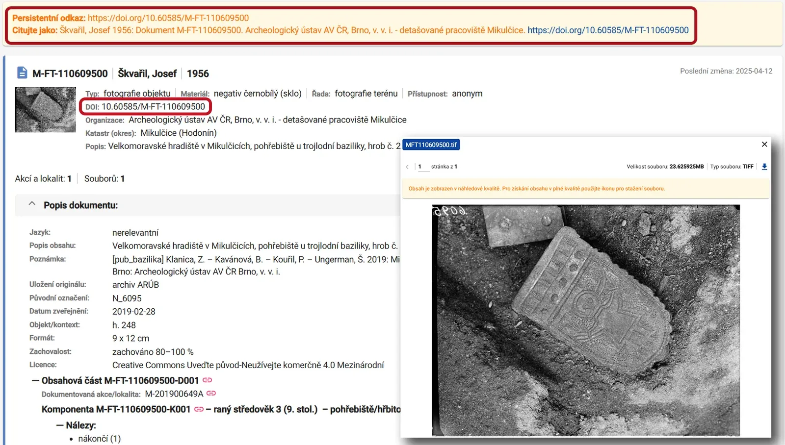
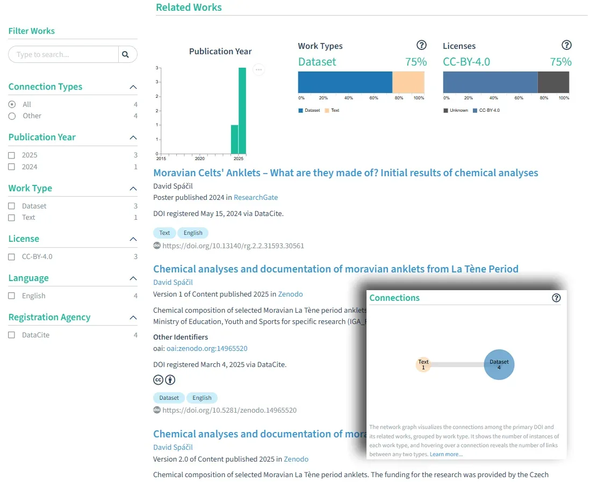

Už se vám stalo, že jste chtěli znovu otevřít článek nebo dataset a odkaz prostě nefungoval? V digitálním světě není vůbec snadné udržet si přehled o tom, kde co leží. Odkazy zastarávají, obsah se přesouvá, weby mizí. A právě proto vznikl DOI – Digital Object Identifier. Tahle krátká kombinace číslic a znaků dokáže ušetřit spoustu času i nervů.

DOI patří mezi tzv. perzistentní identifikátory (PID). Na rozdíl od běžného URL je stálý – s nadsázkou můžeme říct, že jde o takové digitální rodné číslo objektu. I když se jeho webová adresa změní, DOI zůstává stejný a vždy vás dovede zpět k tomu, co identifikuje. Navíc je unikátní, takže dvě různé věci nikdy nemají stejný DOI.

Každý DOI se skládá z předpony (prefixu) a přípony (suffixu), oddělených lomítkem.

- Předpona (prefix) je kombinací čísel oddělených tečkou a přiděluje ho agentura (viz dále).
- Přípona (suffix) je flexibilní – může obsahovat téměř jakýkoliv identifikátor daného objektu.

DOI přidělují agentury jako [*DataCite*](https://datacite.org/) nebo [*CrossRef*](https://www.crossref.org/) zastřešené nadací [*International DOI Foundation*](https://www.doi.org/). Každý DOI má zároveň vlastní metadatový záznam, kde je uložené jméno autora, název, vydavatel, rok i typ objektu (dataset, článek, obrázek, software…). Popis však může být i mnohem bohatší a nést mnoho informací o daném digitálním objektu. Tyto informace uchová dokonce i potom, co objekt sám přestal být dostupný skrze původního vydavatele či úplně zanikl. I v tom je důležitý přínos PIDů.

## DOI a IGSN v Archeologické mapě České republiky

Ačkoli bývá DOI spojováno hlavně s akademickým publikováním, rozhodně se neomezuje jen na vědce. Dá se použít i pro software, obrázky nebo další typy digitálních objektů. Nejčastěji se ale s DOI opravdu potkáváme v souvislosti s otevřenou vědou.

V AMČR má DOI dnes velmi praktickou roli. Díky zapojení AIS CR do českého uzlu iniciativy [EOSC](https://www.eosc.cz/) a spolupráci s [Národním centrem DOI](https://identifikatory.cz/cs/sluzby/nc-doi/) byly:

- přiděleny DOI všem archivovaným záznamům typu Dokument, které už byly v AMČR – přes 200 000 záznamů,
- využívají prefix 10.60585 jako součást odkazů (např. https://doi.org/10.60585/C-PY-900000071)
- a DOI se nyní automaticky přiděluje každému novému Dokumentu při archivaci.

Další typy záznamů získaly identifikátor IGSN (International Generic Sample Number) – ten je také postavený na systému DOI. Od něj se odlišuje jinými popisnými údaji, které jsou k PID uloženy. Má také svůj vlastní prefix (10.71928) v rámci odkazů DOI (např. https://doi.org/10.71928/C-202009779-N00001).

IGSN byl přidělen:

- všem publikovaným záznamům typu Lokalita (přes 8 700),
- a všem archivovaným Samostatným nálezům (přes 8 500).

Nové záznamy rovněž dostávají IGSN automaticky při archivaci.

## Jak v praxi DOI nebo IGSN v AMČR vypadá?

Původní identifikátor z AMČR zůstal zachovaný jako přípona. Před něj se přidala nová DOI/IGSN předpona a společně tvoří celý perzistentní identifikátor záznamu. Najdete ho u každého příslušného záznamu v [Digitálním archivu AMČR](https://digiarchiv.aiscr.cz/) – a také v doporučené citaci, která je u záznamu uvedena.

## Proč by vás to mělo zajímat?

Když někdo použije citaci s DOI/IGSN ve vědeckém článku, publikaci nebo jiném výstupu, tato informace se dostane do mezinárodních registrů (např. DataCite či CrossRef). Záznam se tak zapojí do tzv. **PID grafu** – propojené sítě identifikátorů článků, datasetů, autorů, institucí i projektů. Díky tomu lze dohledat, kde všude byl záznam citován nebo jinak odkazován, což zvyšuje viditelnost jak samotných dat, tak jejich autorů. Můžete to sami vyzkoušet například nástrojem [*DataCite Commons*](https://commons.datacite.org/).

## Shrnutí

- DOI jsou **perzistentní identifikátory**, které zajišťují dlouhodobou dohledatelnost digitálních objektů.
- Spravují je agentury jako ***DataCite*** nebo ***CrossRef***, které uchovávají také metadata.
- AIS CR zavedl DOI pro všechny **Dokumenty** v AMČR a ve formě IGSN také pro **Lokality** a **Samostatné nálezy**.
- DOI najdete přímo v **Digitálním archivu AMČR**, a je součástí doporučené citace.
- Díky DOI můžete snadno citovat konkrétní záznamy a **sledovat, jak jsou využívané**.

## Chcete vědět víc?

- Přehledné shrnutí od DOI Foundation: [What is a DOI?](https://www.doi.org/the-identifier/what-is-a-doi/)
- Video o DOI od Archaeology Data Service: [An Introduction to Digital Object Identifiers - YouTube](https://www.youtube.com/watch?v=48Rth4IFGY4)
- Video od EOSC-CZ/NTK k národní podpoře DOI: [Digitální identifikátor objektů DOI a jeho národní podpora v ČR - YouTube](https://www.youtube.com/watch?v=YzES8RJMNhQ)
- Prezentace D. Nováka o implementaci PIDů v AMČR: [Persistentní identifikátory a jejich využití v AMČR](https://doi.org/10.5281/zenodo.15600346)
- Článek B. Marwicka a S. E. P. Birch o správné citační praxi pro datasety v archeologii: [A Standard for the Scholarly Citation of Archaeological Data](https://doi.org/10.1017/aap.2018.3)
- Vyzkoušejte si práci s DOI v DataCite Commons: [https://commons.datacite.org/](https://commons.datacite.org/)
