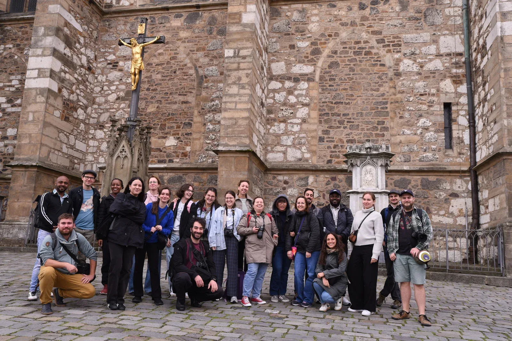
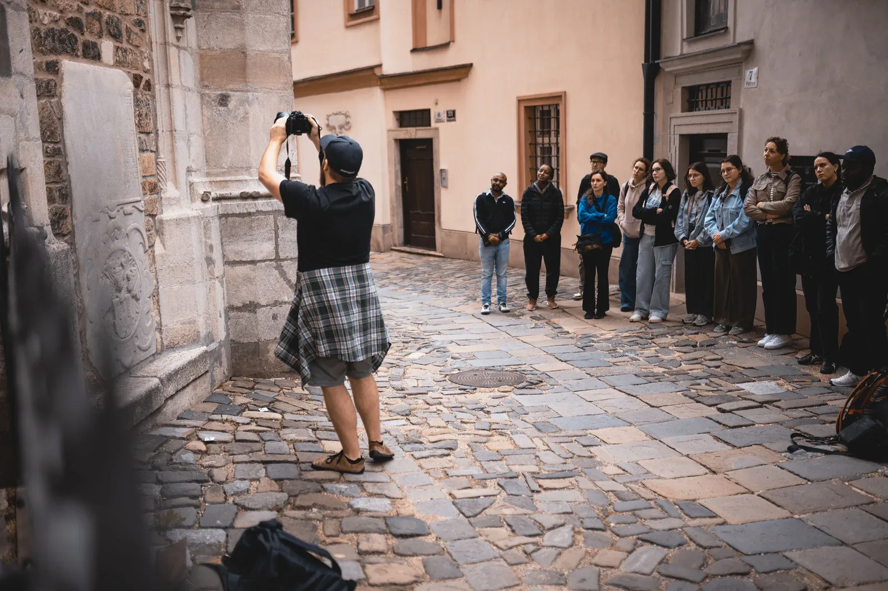
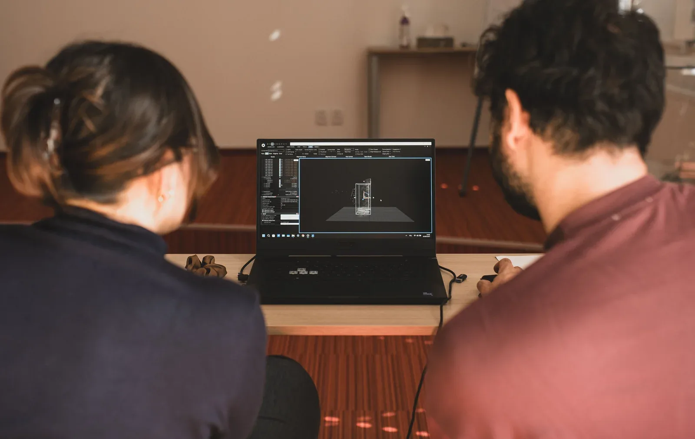
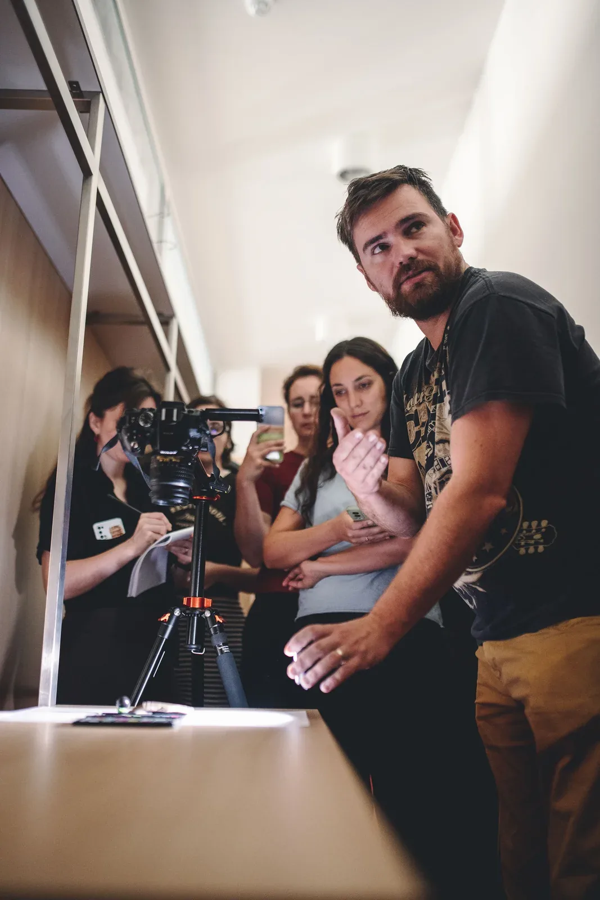

Září v Brně se letos neslo ve znamení moderních technologií. Archeologický ústav AV ČR v Brně (ARÚB) hostil v rámci projektu ATRIUM druhou ze tří plánovaných letních škol. Zatímco loňský ročník patřil statistice a programování v R, letos v září se pozornost upřela na vizuálně atraktivnější téma – využití 3D modelů v archeologii.

Díky grantovému schématu Transnational Access (TNA) se do Brna sjelo 18 studentů a badatelů nejen z různých koutů Evropy, ale i z Afriky. Cíl byl jasný: během pěti dnů, od 15. do 19. září 2025, proniknout do tajů fotogrammetrie, laserového skenování a virtuální rekonstrukce. Na organizaci se kromě hostitelského ústavu podílel též Archeologický ústav AV ČR v Praze a vybraní školitelé z dalších institucí, zejména z Masarykovy univerzity.

## Teorie a první kontakt s technikou

Program byl nabitý od samého začátku. Pondělní úvod patřil teorii, kterou odstartoval Vojtěch Nosek (MUNI) představením principů tvorby 3D modelů. Odpoledne navázal Tomáš Chlup (ARÚ Praha) s praktickou ukázkou fotografických technik. Pro mnoho účastníků to byla první příležitost osahat si (polo)profesionální techniku v manuálním režimu, což je pro kvalitní sběr dat naprostý základ.

Den vyvrcholil přednáškou Lenky Starkové (ZČU), která na příkladu iráckého karavanseráje v Koye demonstrovala propojení laserových skenerů, dronů a HBIM (Historical/Heritage Building Information Modeling). Už první večer na terase ARÚB naznačil, že se zde rodí skvělá parta lidí se společným zájmem.

## Vzhůru na Petrov: dokumentace architektury

V úterý se teorie proměnila v praxi. Účastníci vyrazili přímo do terénu, konkrétně na Petrov ke katedrále sv. Petra a Pavla. Rozkaz zněl jasně: vybrat si architektonický prvek a fotogrammetricky jej zdokumentovat.

Práce v reálných podmínkách přinesla cenné lekce o vlivu světla a počasí. Odpoledne se pak neslo v duchu zpracování dat v softwaru RealityScan. I přes počáteční technické výzvy se všem podařilo vytvořit své první 3D modely. Některé týmy, jako ten [Marthy Moshy](https://atrium-research.eu/blog/finding-my-tribe-at-the-atrium-3-d-models-training-school-2025/), pracovaly s nadšením až do noci, aby dosáhly co nejlepšího výsledku.

## Výzvy v malém měřítku

Středa přinesla změnu měřítka. Od katedrály jsme se přesunuli k drobné archeologii. Vojtěch Nosek seznámil studenty se specifiky dokumentace artefaktů. Účastníci si vyzkoušeli práci s replikami – od bronzové sekery a dýky až po Venuši. Došlo i na práci s profesionálním skenerem Artec Leo.

Jak poznamenala [Barbara Ritterová](https://atrium-research.eu/blog/report-from-atrium-3-d-summer-school/), práce s malými objekty byla překvapivě náročná, protože i drobné odlesky či stíny mohly zásadně ovlivnit výsledek. Zaslouženou odměnou byl společenský večer plný networkingu a mezikulturní výměny, který si účastníci nemohli vynachválit.

## Virtuální světy a budoucnost oboru

Čtvrtek patřil inspiraci a rozšíření obzorů. Jiří Unger (ARÚ Praha) představil koncept virtuální archeologie a ukázal, jak se suchá data mohou proměnit v pohlcující zážitek pro veřejnost. Martin Košťál (MUNI) následně demonstroval proces virtuální rekonstrukce a zdůraznil, že pro kvalitní výsledky není vždy nutné nejdražší vybavení – někdy může být mocným nástrojem i chytrý telefon. Večer program doplnily přednášky zahraničních expertů Roberta Shawa a Simona Radchenka.

## Komunita, která zůstává

Závěrečný den byl věnován rekapitulaci, technice RTI a základům post-processingu modelů v programu Blender. Když se v pátek odpoledne účastníci loučili, neodváželi si jen nové dovednosti v tvorbě a úpravě 3D modelů. Odváželi si především pocit sounáležitosti.

[Marco Brunello](https://atrium-research.eu/blog/my-atrium-3-d-summer-school-brno/) to shrnul nejlépe: *„Byl to týden intenzivního učení, ale také smysluplných sociálních interakcí, které v naší skupině vytvořily skvělý pocit komunity".* I to je jedním z cílů projektu ATRIUM – propojovat badatele a sdílet know-how napříč hranicemi.

*Grantové schéma Transnational Access (TNA) projektu ATRIUM pokračuje čtvrtou výzvou, která je aktuálně otevřena pro přijímání žádostí. V tomto kole je možné žádat o podporu na individuální výzkumné pobyty (Individual Access). Badatelé a badatelky v humanitních vědách mohou získat plně hrazený pobyt (včetně cesty a ubytování) na jedné ze 14 hostitelských institucí v Evropě. Stáže jsou určeny pro rozvoj vlastních výzkumných témat s využitím expertního zázemí a nástrojů hostitele. Uzávěrka přihlášek pro toto kolo je stanovena na 31. prosince 2025.*

## Shrnutí

- **Mezinárodní spolupráce:** Letní škola v Brně pod hlavičkou projektu ATRIUM propojila 18 badatelů a studentů z Evropy i Afriky, čímž podpořila sdílení know-how napříč hranicemi.
- **Komplexní záběr:** Program pokryl vše od makro-dokumentace architektury (katedrála na Petrově) až po detailní snímání drobných artefaktů v laboratorních podmínkách.
- **Technologie v praxi:** Účastníci si osvojili práci s profesionální fototechnikou, laserovými skenery a softwarem pro tvorbu i post-processing 3D modelů (např. RealityScan, Blender).
- **Virtuální archeologie:** Akce ukázala, že 3D dokumentace není jen o archivaci dat, ale otevírá cestu k imerzivním zážitkům a atraktivní prezentaci památek veřejnosti.
- **Viditelné výsledky:** Nově nabyté dovednosti studenti ihned přetavili do hotových 3D modelů, které jsou k vidění [online](https://arup-cas.github.io/atrium-school3d/report.html).

## Chcete vědět víc?

- Jak summer school probíhala z pohledu účastníků si můžete prohlédnout na stránkách akce: [Insights and recap – ATRIUM 3D Models Training School](https://arup-cas.github.io/atrium-school3d/report.html)
- Materiály používané během summer school: [Materials and data](https://arup-cas.github.io/atrium-school3d/materials.html)
- Více o schématu TNA v projektu ATRIUM: [Transnational Access Scheme Grants](https://atrium-research.eu/travel-grants/)
- K tvorbě modelů byl použit především RealityScan: [https://realityscan.com/](https://realityscan.com/)
- K úpravě modelů Blender: [https://www.blender.org/](https://www.blender.org/)
- Návody k tvorbě 3D modelů pomocí fotogrammetrie: [Epic Developer Community](https://dev.epicgames.com/community/realityscan/learning?types=tutorial)

*Obr. 1: autor Vojtěch Nosek.  
Obr. 2–4: autor Tomáš Chlup.*
