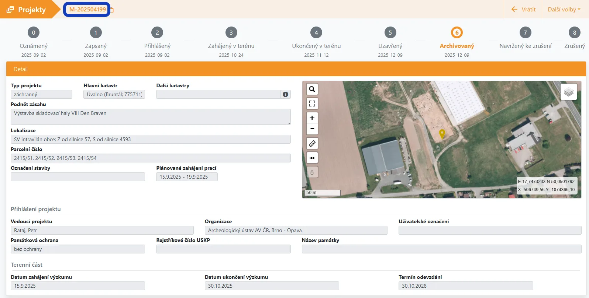
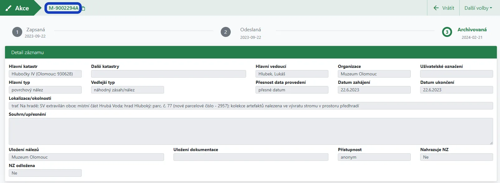
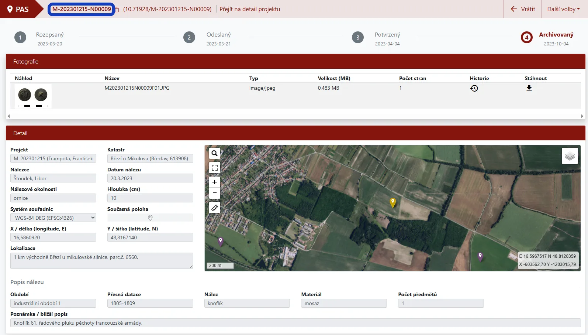
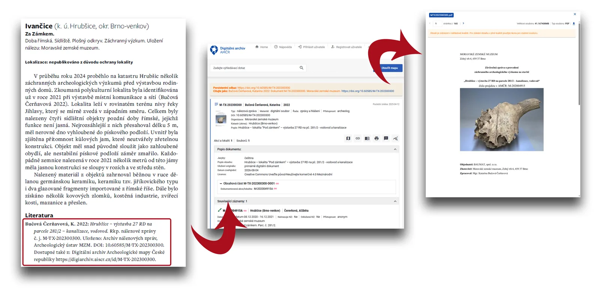
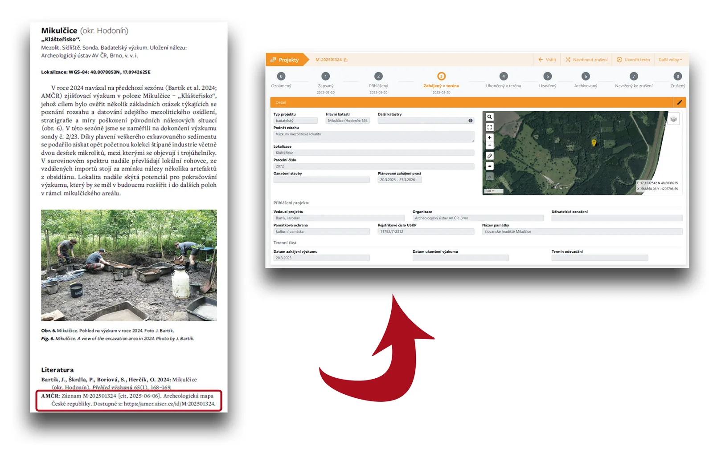

Časopis [*Přehled výzkumů*](https://www.arub.cz/prehled-vyzkumu/o-casopisu/) (PV), vydávaný od roku 1956, patří dlouhodobě k základním volně dostupným informačním zdrojům o archeologických výzkumech na Moravě a ve Slezsku. Vydává jej dvakrát ročně Archeologický ústav AV ČR, Brno, v. v. i., a jeho struktura kombinuje recenzované odborné studie s nerecenzovanými částmi Varia a Přehled výzkumů na Moravě a ve Slezsku (výzkumné zprávy). Každý rok tak vzniká jedinečný souhrnný přehled terénní archeologické činnosti, který v této podobě nenajdeme v žádném jiném zdroji – od rozsáhlých záchranných výzkumů až po jednotlivé nálezy.

Tyto zprávy jsou charakteristické svou stručností a přehledností. Dlouhodobě zprostředkovávají základní informace o tom, kde, kdy a v jakém rozsahu výzkum proběhl a jaké přinesl výsledky. Zásadní změnu přinesl rok 2018, kdy byl celý archiv časopisu zpřístupněn online, včetně možnosti vyhledávání a filtrování obsahu. Od té doby jsou nové ročníky vedle tištěné podoby systematicky publikovány také [na webu](https://www.arub.cz/prehled-vyzkumu/vyhledat-clanek/).

Právě tato digitální dostupnost otevřela prostor pro další krok: důsledné propojení příspěvků v *Přehledu výzkumů* s oborovou evidencí v [Archeologické mapě České republiky (AMČR)](https://amcr-info.aiscr.cz/). Díky propojení prostřednictvím identifikátoru získávají čtenářky a čtenáři okamžitý přístup k odpovídajícímu záznamu v AMČR nebo k fondu dokumentace v [Digitálním archivu AMČR](https://digiarchiv.aiscr.cz/) a mohou snadno dohledat další související informace, které se k danému výzkumu nebo nálezu vážou.

## Co se mění od PV 67/1

Od čísla PV 67/1 dochází ke změně v odevzdávání výzkumných zpráv. V [online formuláři](https://zprava.arub.avcr.cz/) je nově **povinné k vyplnění pole „Číslo AMČR“**, které bylo dosud nepovinné. Uzávěrka pro podání zpráv do čísel 67/1 i 67/2 je stanovena na polovinu února.

Smyslem této změny je posílení provázanosti mezi publikovanými texty a evidencí archeologických výzkumů a nálezů. Podrobné zdůvodnění tohoto kroku je popsáno v [Editorialu](https://www.arub.cz/wp-content/uploads/PV-64_2_00_ok.pdf) PV 64/2 a v [Důležitých informacích redakce](https://www.arub.cz/wp-content/uploads/PV-66_1_00.pdf) v čísle 66/1.

Do pole „Číslo AMČR“ autor jednoduše vloží identifikátor převzatý přímo z AMČR. Může se jednat o tyto typy záznamů:

- **Projekt** (například “M-202504199”) – terénní archeologický výzkum (záchranný nebo badatelský). Číslo je možné použít bez ohledu na to, zda je již vytvořena projektová akce a přiložena nálezová zpráva nebo ne.

- **Samostatnou akci** (například “M-9002294A”) – drobnější aktivity, jako je povrchový sběr, náhodný nález nebo nedestruktivní průzkum (např. geofyzika). U samostatných akcí je důležité upozornit na to, že **dočasný identifikátor začínající „X-“ (*stav rozepsaná*) nelze do PV použít**. Pro získání trvalého identifikátoru je nutné připojit nálezovou zprávu, která dle charakteru zjištění může mít formu [zkrácené nálezové zprávy](https://amcr-help.aiscr.cz/amcr/drobne-akce.html), a akci odeslat.

- **Samostatný nález** (například “M-202301215-N00009”) – konkrétní nález evidovaný v modulu AMČR-PAS. Číslo je možné použít bez ohledu na to v jakém procesním stavu se záznam nachází.

Při nejasnostech nás neváhejte kontaktovat na [amcr@arub.cz](mailto:amcr@arub.cz).

## Jak propojení PV a AMČR funguje v praxi

Jako součást redakčních služeb se tým AIS CR podílí na systematickém propojování článků a výzkumných zpráv v PV s daty shromažďovanými v evidenčním systému AMČR. Výsledkem je, že po přečtení krátké zprávy není nutné složitě dohledávat další informace o daném výzkumu.

Pokud je již evidence kompletní a záznam v AMČR archivovaný, je k výzkumné zprávě v PV přidán odkaz do Digitálního archivu AMČR na konkrétní fond dokumentace daného výzkumu. Pokud zatím evidence kompletní není (například proto, že zpracování výzkumu stále probíhá), je u výzkumné zprávy odkaz do AMČR, kde si mohou uživatelé a uživatelky s oprávněním archeolog ověřit aktuální stav výzkumu. Po zkompletování a archivaci záznamu je pak možné číslo AMČR použít k dohledání fondu dokumentace v Digitálním archivu. Výzkumná zpráva se tak stává vstupním bodem k širšímu datovému kontextu.

## Od stručného textu ke zdrojovým datům

Nejviditelnějším přínosem propojení je jednoduchost. Místo zdlouhavého dohledávání je kliknutím možné **plynule přejít od textu přímo k souvisejícím datům**. *Přehled výzkumů* tak může sloužit nejen jako přehled, ale i jako východisko pro další práci: porovnávání, citování, ověřování i návazný výzkum.

Krátké zprávy si přitom zachovávají svůj přehledný a stručný charakter a jsou zveřejňovány již v následujícím roce po terénním výzkumu, což zajišťuje rychlou dostupnost základního přehledu a předběžnou interpretaci. Vedle textu v nich mají své místo i vybrané obrazové přílohy, které zprávu ilustrují nebo názorně zachycují klíčová zjištění učiněná při výzkumu. Rozsah textu tak zůstává přiměřený jeho účelu, zatímco podrobnější dokumentace je zpřístupněna jinde.

Detailnější data – nálezové zprávy, mapy, fotografie, plány, seznamy nálezů, expertní posudky či další přílohy – tedy kompletní fond dokumentace výzkumu, je uložen tam, kam patří: v AMČR a dle přístupnosti zveřejněný v Digitálním archivu AMČR. Data při archivaci procházejí odbornou kontrolou a zůstávají dlouhodobě dostupná. Čtenáři a čtenářky PV si tak sami volí, zda jim stačí základní přehled, nebo se chtějí ponořit hlouběji do souvisejících dat a dokumentace.

## Text, který neztrácí platnost

Zprávy PV se odevzdávají v pevně daném termínu, aby byl časopis včas publikován online i v tištěné formě, ale řada informací v té době ještě nemusí být kompletní – výsledky analýz, laboratorní zpracování materiálu, finální uložení nálezů a podobně. Odkaz na evidenční záznam však směřuje do AMČR, kde mohou být data až do archivace průběžně doplňována.

Díky tomu *Přehled výzkumů* zůstává dlouhodobě platným zdrojem informací, protože dále funguje jako rozcestník k datům, která se o daném výzkumu či nálezu postupně objevují.

## Jednotný identifikátor jako záruka dohledatelnosti

Identifikátor AMČR funguje jako digitální “otisk prstu” záznamu – je jedinečný, neměnný a provází jej ve všech procesních stavech. Zvyšuje dohledatelnost, usnadňuje citování a snižuje riziko záměny, což je klíčové zejména u odlišných výzkumů na stejné lokalitě nebo u vzájemně podobných terénních akcí.

Pro využití ve výzkumu je tento prvek zásadní: další studie může odkázat na konkrétní projekt, akci či nález a čtenářky a čtenáři mají možnost dohledat související dokumentaci i kontext, tedy podkladová data pro navazující výzkum.

## Provázaná data, větší transparentnost

Povinné uvádění čísla AMČR má také efekt datové hygieny – podporuje systematickou evidenci výzkumů a nálezů, což je důležité jak z odborného hlediska, tak z pohledu legislativních závazků. Zprávy PV se tak stávají přirozeným kontrolním bodem – absence identifikátoru upozorňuje na chybějící evidenci, a takový příspěvek nelze do PV přijmout.

Propojení PV s AMČR zároveň posiluje transparentnost a důvěryhodnost oboru. Zpráva není izolovaným tvrzením, ale je jasně propojena s evidencí, což usnadňuje orientaci orgánům státní správy a zvyšuje důvěru odborné i širší veřejnosti.

## Samostatné nálezy s doloženým původem

Zvláštní význam má jednotný identifikátor v prostředí AMČR-PAS při práci s nálezy od spolupracovníků a spolupracovnic oprávněných organizací. Umožňuje jednoznačně odkazovat na informace o původu nálezu, zodpovědné osoby a instituci, lokalizaci i navázanou dokumentaci. Díky odkazu na tento evidenční záznam, může *Přehled výzkumů* publikovat tyto nálezy způsobem, který je v souladu s legislativními požadavky archeologického výzkumu a podporuje jejich další vědecké využití.

## Shrnutí

- Časopis *Přehled výzkumů* nabízí mimo jiné stručný přehled archeologické terénní činnosti na Moravě a ve Slezsku nejen za uplynulý rok v tištěné i digitální verzi (Open Access).

- Povinnost uvádět u výzkumných zpráv číslo AMČR od PV 67/1 posiluje provázanost publikovaných zpráv s oborovou evidencí.

- Propojení PV s AMČR a Digitálním archivem umožňuje čtenářům a čtenářkám přímý přechod od textu ke zdrojovým datům a dokumentaci.

- Identifikátor AMČR omezuje záměny, usnadňuje citování a podporuje provázanost vědeckých výstupů.

- Výsledkem je vyšší transparentnost a dostupnost informací, přínosná pro odbornou komunitu, veřejnost i státní správu.

## Chcete vědět víc?

- *Přehled výzkumů* - informace o časopisu [O časopisu - Archeologický ústav AV ČR, Brno](https://www.arub.cz/prehled-vyzkumu/o-casopisu/)
- *Přehled výzkumů* - formulář výzkumné zprávy [Zpráva o výzkumu](https://zprava.arub.avcr.cz/)
- Důležité informace redakce PV 66/1 [Obálka-Tiráž-Obsah-Editorial](https://www.arub.cz/wp-content/uploads/PV-66_1_00.pdf)
- Editorial PV 64/2 [Obálka-Tiráž-Obsah-Editorial](https://www.arub.cz/wp-content/uploads/PV-64_2_00_ok.pdf)
- Návod na editaci projektu v AMČR [Správa projektů – Dokumentace AMČR](https://amcr-help.aiscr.cz/amcr/projekty.html)
- Návod na editaci samostatné akce v AMČR [Správa akcí – Dokumentace AMČR](https://amcr-help.aiscr.cz/amcr/akce.html)
- Návod na editaci samostatného nálezu V AMČR [Správa samostatných nálezů – Dokumentace AMČR](https://amcr-help.aiscr.cz/amcr/amcr-pas/amater.html#zapsat)
- Postup pro zpracování nálezových zpráv z akcí drobného rozsahu [Akce drobného rozsahu – Dokumentace AMČR](https://amcr-help.aiscr.cz/amcr/drobne-akce.html)
