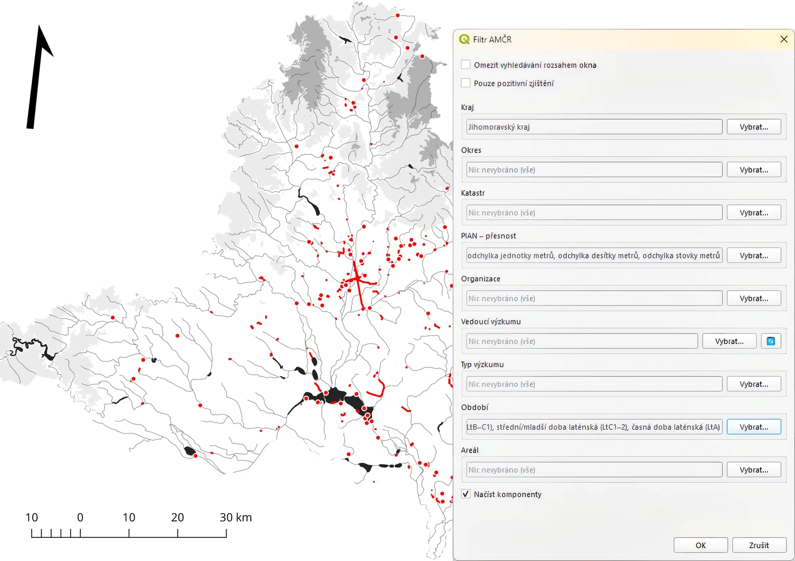

Nový plugin do prostředí QGIS **AMČR Viewer** jsme vám představili již dříve v [příspěvcích na sociálních sítích](https://www.facebook.com/ArcheologickyInformacniSystem/posts/pfbid0jGSZiTUS4BTmzzX9ZGndp6cvDgKgQVGVQcMKSXPcdeMxR2ZA2uYNzDL3MSqVB5a2l).
Nyní bychom jej, již v aktualizované podobě a s novými funkcemi, chtěli připomenout a trochu více přiblížit i zde na blogu. 

V AIS CR se vám snažíme přinášet vždy nové a užitečné služby, ale – přiznáme barvu – možnost jednoduchého exportu dat z Archeologické mapy České republiky chyběla i nám.
V tomto ohledu je AMČR Viewer šikovný nástroj umožňující přímé využití dat spravovaných v rámci AMČR. 

## Co tedy AMČR Viewer vlastně umí?

Přes API [Digitálního archivu AMČR](https://digiarchiv.aiscr.cz) **přistupuje k datům o archeologických *akcích* a *lokalitách***.
Nabízí **filtrování na základě vybraných metadat** (kromě prostorových a administrativních dat jde zejména o filtrování pomocí kontextuálních informací – pole **datace a typ areálu**).

Záznamy, které odpovídají filtru, pak automaticky stahuje a předkládá uživateli či uživatelce ve formě dočasných vrstev rozdělených podle typu geometrie (body, linie a polygony).
Každá z vrstev obsahuje i atributovou tabulku s daty z AMČR. 

## Dokumentační jednotka jako základ

Jako nejvhodnější základní prvek byla na základě poměrně složité datové struktury AMČR vybrána [***dokumentační jednotka***](https://amcr-help.aiscr.cz/slovnik/#dokumenta%C4%8Dn%C3%AD-jednotky).
Jednotlivé [*akce*](https://amcr-help.aiscr.cz/slovnik/#akce) jsou tak rozděleny právě podle těchto svých podřízených prvků.
To se netýká [*lokalit*](https://amcr-help.aiscr.cz/slovnik/#lokality), které obsahují vždy právě jednu *dokumentační jednotku*.
Více o datovém modelu AMČR si můžete přečíst na příslušné stránce dokumentace. 

*Dokumentační jednotka* (obohacená o metadata jí nadřazeného záznamu) je však jakýmsi kompromisem mezi zastřešujícím záznamem – *akcí* či *lokalitou* – a podrobnou informací o archeologickém kontextu – [*komponentou*](https://amcr-help.aiscr.cz/slovnik/#komponenty) (ačkoli by se jako vhodný základní prvek mohla jevit právě *komponenta*, vnášelo by to do výsledků příliš velké množství redundantních prostorových dat).
O informace, které nesou *komponenty*, ale uživatelé ani uživatelky nejsou ochuzeni – jsou totiž obsaženy v další (v pořadí již čtvrté) atributové tabulce.
Tabulka *komponent* obsahuje pouze metadata (nenese žádnou prostorovou informaci), je ale pomocí [relace](https://docs.qgis.org/3.44/en/docs/user_manual/working_with_vector/joins_relations.html#polymorphic-relations) navázána na vrstvy *dokumentačních jednotek*, které tímto obohacuje o archeologická data.

## Reálné use-casy aneb k čemu je to dobré?

AMČR Viewer vám najde a do mapy vykreslí například:

* na základě zvoleného filtru podle oprávněné organizace třeba všechny výzkumy Archeologického centra Olomouc nebo jakékoliv jiné organizace podle vlastní volby,

* na základě zvoleného filtru podle kraje a komponenty třeba všechny výzkumy v Jihomoravském kraji, při kterých se našly doklady pohřebních aktivit laténské kultury,

* na základě zvoleného filtru podle kraje, komponenty a druhu lokality pozůstatky ohrazení z pozdní doby bronzové v Čechách

a mnoho dalšího, přičemž všechny tyto výsledky můžete dále filtrovat a analyzovat podle přiložených metadat. 

Rozveďme si teď jeden z příkladů trochu více:
*Jsem student a píšu diplomovou práci, do které chci použít mapu laténských areálů aktivit na jižní Moravě.
V AMČR Viewer si navolím filtr pro **kraj** – Jihomoravský, **období** – všechna období související s dobou laténskou a nezapomenu zakliknout možnost **"Načíst komponenty"**.
Po potvrzení se mi načtou všechny záznamy odpovídající filtrům do tří tabulek: **body**, **linie** a **polygony**. 
Objeví se mi všechny výzkumy v Jihomoravském kraji, při kterých byly nalezeny doklady aktivit z doby laténské.
Díky tomu, že mám **s výsledky spojená i data z příslušných komponent**, můžu pomocí nich filtrovat.
Otevřu si tedy postupně nad každou z vrstev (body, linie, polygony) filtrační formulář (**Vybrat prvky dle hodnoty**) a zcela dole můžu pak pomocí polí `komponenta_areal` nebo `komponenta_obdobi` filtrovat a vybírat výsledky dále (je nutné se ujistit, že vpravo od zadávacího pole jsou v seznamech možností vybrané položky `řetězit` a `obsahuje`)*.

> *Příklad vizualizace proběhlých výzkumů (archeologických akcí) v Jihomoravském kraji, při kterých byly nalezeny památky z doby laténské.*

Doufáme, že vám bude plugin k užitku!

*Plugin je dostupný ke stažení v nástroji Manage and install plugins přímo v prostředí QGIS.* 

## Shrnutí: Co umí AMČR Viewer?

* **Přímý přístup:** QGIS plugin pro snadné stahování a export dat z Archeologické mapy ČR.  
* **Chytré filtrování:** Vyhledávání archeologických *akcí* a *lokalit* podle metadat (např. datace či typ areálu).  
* **Okamžitá vizualizace:** Výsledky rovnou vykresluje jako dočasné mapové vrstvy (body, linie, polygony) s plnými atributovými tabulkami.  
* **Optimalizovaná data:** Základem je *dokumentační jednotka* (minimalizuje duplicity), detailní informace o *komponentách* jsou dostupné v propojené tabulce.  
* **Praktické využití:** Rychlá tvorba map a prostorová analýza archeologických dat na pár kliknutí.

## Chcete vědět víc?

- [Datový model AMČR](https://amcr-help.aiscr.cz/o-systemu/datovy-model.html) 
- [Tutoriál v dokumentaci](https://amcr-help.aiscr.cz/digiarchiv/qgis-viewer.html) 
- [Github repozitář](https://github.com/ARUP-CAS/aiscr-qgis-amcr-viewer) 
- [QGIS plugins repozitář](https://plugins.qgis.org/plugins/amcr_viewer/) 
- [Poster Hromadné sklízení prostorových dat Digitálního archivu AMČR pro GIS](https://doi.org/10.5281/zenodo.11490822) 
- [Poster Import/Export. Pluginy propojující QGIS s AMČR](https://doi.org/10.5281/zenodo.19217286)
