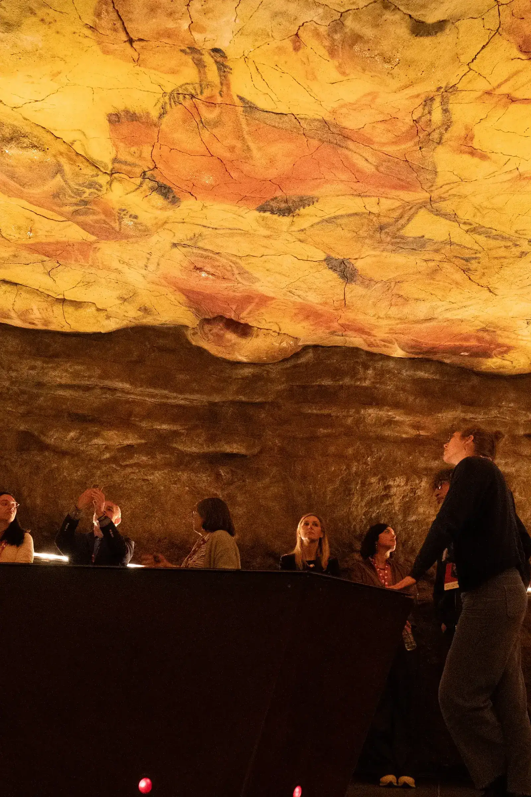
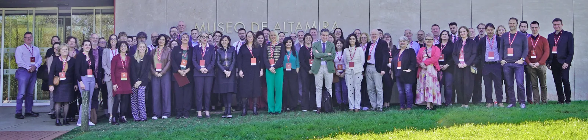

*Evropská archeologická rada (EAC) dlouhodobě udává směr diskuzím o správě a ochraně archeologického dědictví v Evropě. Mnohé z jejích doporučení inspirují také rozvoj infrastruktury AIS CR. Přinášíme vám proto reportáž z letošního výročního zasedání.* 

*Text vychází z článku publikovaného v časopise Přehled výzkumů 67/1 a je zveřejněn se souhlasem redakce.*

Ve dnech 19.–21. března 2026 se uskutečnilo 27. výroční zasedání Evropské archeologické rady ([EAC – *Europae Archaeologiae Consilium*](https://www.europae-archaeologiae-consilium.org/)) v návštěvnickém centru u jeskyně Altamira ve španělské Kantábrii. Hlavním tématem letošní konference bylo [*Bridging Borders in Heritage Protection: Best practice against archaeological crime*](https://www.europae-archaeologiae-consilium.org/_files/ugd/881a59_6eaf0287066a4c8985a8fb6bb5f4bf34.pdf). Vedle samotné konference jsou pravidelnou součástí setkání také workshopy pracovních skupin při EAC. Česká republika byla aktivně zastoupena Národním památkovým ústavem, Archeologickým ústavem AV ČR, Praha (ARÚ), a Archeologickým ústavem AV ČR, Brno (ARÚB).

## Evropská archeologická rada a její poslání

Evropská archeologická rada sdružuje instituce z členských států, které mají ze zákona odpovědnost za správu archeologického dědictví. Českou republiku, jako jednoho ze zakládajících členů, zastupuje Národní památkový ústav jako řádný člen a Archeologický ústav AV ČR, Praha jako člen přidružený. Naše země má dlouhodobě své zástupce také ve vedení této organizace.

Posláním EAC je podporovat spolupráci a výměnu informací mezi těmito institucemi, přispívat prostřednictvím pracovních skupin k formulaci společných přístupů v archeologické památkové péči a působit jako poradní orgán ve vztahu k Radě Evropy a Evropské unii. Současně podporuje ochranu, odborné poznávání, publikování, prezentaci a zpřístupňování archeologického dědictví veřejnosti a napomáhá k lepšímu porozumění, jak s ním nakládat. 

> Kopie jeskyně Altamira, známá jako “Neocueva”. © Ministerio de Cultura. Museo Nacional y Centro de Investigación de Altamira.

## Historie a vývoj EAC

Vznik EAC v roce 1999 navázal na setkání a „kulaté stoly“ správců archeologického dědictví, které se odehrávaly v rámci každoročních konferencí Evropské archeologické asociace ([EAA – *European Association of Archaeologists*](https://www.e-a-a.org/)). U zrodu nové organizace stáli členové expertního výboru, který připravil znění Maltské úmluvy. V kontrastu k organizacím založeným na individuálním členství, jakou je právě EAA, bylo základní myšlenkou vytvořit platformu sdružující instituce s přímou zákonnou odpovědností, která dokáže efektivněji převádět odborná doporučení do praxe. Vazby mezi EAC a EAA však zůstávají silné a projevují se ve společných aktivitách a výstupech, mezi něž patří například Pracovní skupina pro zemědělství, lesnictví a správu venkovské krajiny ([*Working Group on Farming, Forestry and Rural Land Management*](https://www.e-a-a.org/EAA/EAA_New/Membership/Communities%20pages/Working_Group_on_Farming,_Forestry_and_Rural_Land_Management.aspx)) nebo čtvrtletník [*European Affairs Update*](https://www.europae-archaeologiae-consilium.org/european-affairs-update).

## Strategické priority a výstupy EAC

Činnost EAC se dlouhodobě opírá o principy a cíle stanovené Maltskou úmluvou (Úmluva o ochraně archeologického dědictví Evropy z roku 1992) nebo Úmluvou z Faro (Úmluva o hodnotě kulturního dědictví pro společnost z roku 2007). Další strategické směřování bylo vytyčeno v roce 2015 dokumentem [*Amersfoort Agenda*](https://doi.org/10.5281/zenodo.10686954), na který navázala iniciativa *Making Choices*. Ta vedla k ustavení několika pracovních skupin zaměřených na klíčové otázky archeologické památkové péče. Výsledkem jejich činnosti byla [řada metodických příruček a doporučení](https://www.europae-archaeologiae-consilium.org/guidance) zaměřených například na přínosy záchranné archeologie, na téma selekce při tvorbě archeologických fondů nebo definování národních výzkumných rámců. Tyto materiály jsou volně dostupné online a představují jeden z praktických výstupů EAC.

Na základě průzkumu mezi zástupci členských zemí byly v roce 2024 formulovány [aktuální priority EAC](https://doi.org/10.11141/ia.72.3), které odrážejí současné výzvy oboru: 

- Potenciál občanské vědy 

- Památková kriminalita 

- Role archeologického dědictví při správě krajiny a územním plánování 

- Dopady změny klimatu a potřeba udržitelnosti oboru

Příspěvky z každoroční tematicky zaměřené konference jsou pravidelně zveřejňovány ve zkrácené verzi ve sborníku [*EAC Occasional Papers*](https://www.europae-archaeologiae-consilium.org/symposiumproceedings) a v plné verzi v online časopise [*Internet Archaeology*](https://intarch.ac.uk/issues/index.html).

## Konference 2026: Archeologická kriminalita jako hlavní téma

Odborná, konferenční část výročního setkání byla zaměřena na problematiku archeologické kriminality, zejména na nelegální obchod s archeologickými nálezy a vykrádání archeologických lokalit. Tomu odpovídaly i tři sekce, které cílily na dílčí aspekty problému: 

- Spravedlnost pro dědictví: Právní reformy v boji proti drancování archeologického dědictví (*Justice for Heritage: Legal improvements against looting of archaeological heritage*) 

- Kolaborativní přístupy (*Collaborative approaches*) 

- Inovativní přístupy ke snižování kriminality (*Innovative approaches to reducing crime*)

> *Účastníci a účastnice výročního setkání EAC. © Ministerio de Cultura. Museo Nacional y Centro de Investigación de Altamira.*

## Právní nástroje a změna společenského přístupu

První sekce měla pojmenovat odlišné potřeby států, a tedy i jejich rozdílné přístupy k řešení problémů. Přednášející věnovali pozornost zpřísňování trestů, nedostatkům mezinárodního práva, způsobu posuzování škody, tvorbě metodik či vzdělávání. V poslední uvedené oblasti stojí za zmínku úvodní příspěvek konference, který přednesl Leonard de Witt z holandského památkového úřadu (Cultural Heritage Agency of the Netherlands). Výbornou glosou přirovnal fungování nelegálního obchodu s archeologickými nálezy k obchodu s drogami (společensky akceptované, velké úsilí proto přináší pouze malý úspěch) a, trochu nečekaně, s exotickými zvířaty. Pointu příspěvku vystihl ve výroku jednoho z prodejců plazů: „*My reptiles have gone out of fashion, they are outdated*.” Právní nástroje totiž mohou fungovat pouze za předpokladu, že se společnost ztotožňuje s nastavenými pravidly. V opačném případě bude zákony porušovat. Proto je nutné pracovat s veřejností a vzděláváním, aby společnost pochopila, že archeologické dědictví není artiklem. Když se to podaří, obchod s archeologickými nálezy vyjde z módy stejně jako obchod s exotickými plazy.

## Spolupráce archeologů, institucí a veřejnosti

V druhé sekci byly představeny různé formy a druhy spolupráce – jak mezi odborníky a laiky, tak mezi odborníky různých států. Do první kategorie lze zařadit příspěvek od kolegů z Lucemburska (Mei Duong a David Weis, National Institute of Archaeological Research, Luxembourg) či Saska (Josefine Falkenberg, Archaeological Heritage Office of Saxony, Germany), kteří postupně vytváří koncepční řešení spolupráce mezi archeology a amatéry. K tomu patří také vývoj evidenčních systémů, které ale prozatím nedosahují úrovně nastavené nizozemským [PAN](https://portable-antiquities.nl/pan/#/public), britským [PAS](https://finds.org.uk/), či českým [AMČR-PAS](https://amcr-info.aiscr.cz/amcr-pas/). Mezinárodní spolupráci představila Eva Steigbergerová z Rakouska (Federal Monuments Authority, Austria), která demonstrovala mimo jiné úspěšnou spolupráci se Slovenskem při navrácení římské masky.

## Inovativní přístupy: od AMČR-PAS po umělou inteligenci

V sekci zaměřené na inovativní přístupy zaznělo několik příspěvků, které se opět týkaly spolupráce mezi archeology a detektoráři. Ve společném příspěvku zde Archeologické ústavy AV ČR (Jan Mařík za ARÚ, a Róbert Antal za ARÚB) představili právní rámec využití AMČR-PAS při formalizaci a kultivaci spolupráce s amatéry, a také roli tohoto informačního systému při edukaci a prezentaci archeologického dědictví. Příspěvky s podobným zaměřením přednesli také kolegyně ze Slovinska (Judita Lux a Mihela Kajzer, Institute for the Protection of Cultural Heritage of Slovenia, Ursula Belaj, Criminal Police Directorate, Slovenia) a Estonska (Ulla Kadakas, Estonian History Museum, Nele Knagert, National Heritage Board, Tuuli Kurisoo, Talinn University, Estonia). Z tohoto rámce vybočovaly dva příspěvky, které stojí za samostatnou zmínku: 

- Barney Sloane, zastupující Marka Harrisona (oba z Historic England, UK) prezentoval intenzivní práci s různými společenskými a profesními skupinami – tréninkové programy pro policii či iniciativa na zapojení mládeže slaví úspěchy, protože v praxi pomáhají předcházet protiprávní činnosti a zároveň budovat pozitivní vztah ke kulturnímu dědictví. 

- Dante Abate (ERATOSTHENES Centre of Excellence, Limassol, Cyprus) ve svém technologicky zaměřeném příspěvku představil nástroj na monitorování online prodeje kulturního dědictví, který zahrnuje využití umělé inteligence.

## Závěrem

Dokladem dobře zvoleného tématu konference a zájmu účastníků byla čilá diskuze, a to jak v jednotlivých sekcích, tak i mimo ně. Setkání tak bylo vhodným místem pro networking a budování základů pro budoucí mezinárodní spolupráci. Snad tedy můžeme věřit, že se ochrana archeologického dědictví bude nadále zlepšovat.

## Shrnutí

- EAC propojuje evropské instituce odpovědné za správu archeologického dědictví a vytváří společné standardy archeologické památkové péče.  

- Doporučení a metodiky EAC přispívají k modernizaci správy archeologického dědictví v Evropě a inspirují rozvoj české infrastruktury AIS CR.   

- Hlavním tématem letošního výročního zasedání byla archeologická kriminalita, zejména boj proti nelegálnímu obchodu s nálezy a vykrádání archeologických lokalit.   

- Účinná ochrana archeologického dědictví vyžaduje vedle legislativy také vzdělávání veřejnosti, mezinárodní spolupráci a využívání moderních technologií, včetně umělé inteligence.

## Chcete vědět víc?

- [Webové stránky EAC](https://www.europae-archaeologiae-consilium.org/)

- [Metodické příručky a doporučení EAC](https://www.europae-archaeologiae-consilium.org/guidance)

- [Sborníky z konferencí EAC](https://www.europae-archaeologiae-consilium.org/symposiumproceedings) 

- [Čtvrtletník *European Affairs Update*](https://www.europae-archaeologiae-consilium.org/european-affairs-update) 

- [Článek *The EAC at 25: Looking Forward*](https://doi.org/10.11141/ia.72.3) (J. Butterworth)

- [Článek *Amersfoort Agenda – Setting the Agenda for the Future of Archaeological Heritage Management in Europe*](https://doi.org/10.5281/zenodo.10686954) (P. A. C. Schutt, D. Scharff, L. C. de Witt)

- [Program konference *Bridging Borders in Heritage Protection. Best practice against archaeological crime*](https://www.europae-archaeologiae-consilium.org/_files/ugd/881a59_6eaf0287066a4c8985a8fb6bb5f4bf34.pdf) 

- [Časopis Přehled výzkumů 67/1 s původním textem](https://www.arub.cz/wp-content/uploads/PV-67_1_14.pdf)
