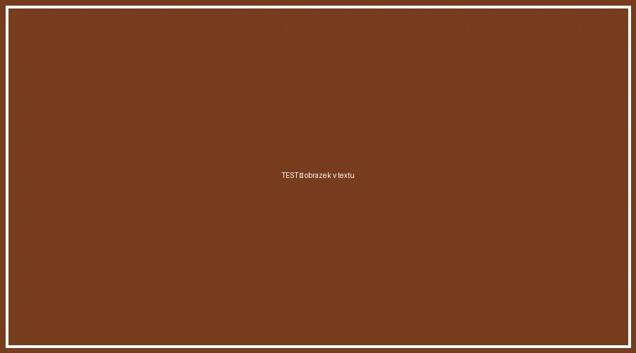

This article is a **temporary test** of the shared news feed. It will be deleted after verification.

## What this article verifies

- publishing from the central repository to GitHub Pages,
- loading the `aiscr/en.json` feed on the website side,
- rendering of the cover image, badge and reading time,
- listing multiple authors on a single article.

## Text formatting

A paragraph with a [link to the AIS CR website](https://www.aiscr.cz/), *italics*,
**bold text** and `inline code`.

> A blockquote to verify that block elements render correctly.

If you can see this article on the site and in the feed, the whole chain works.
