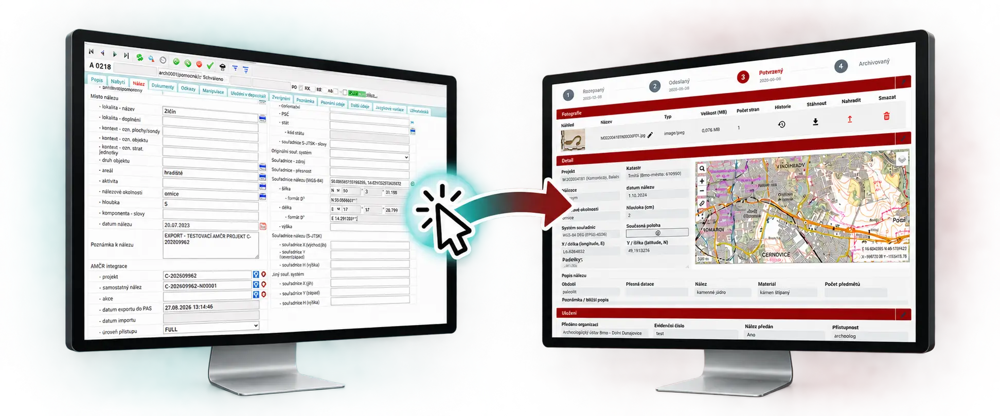
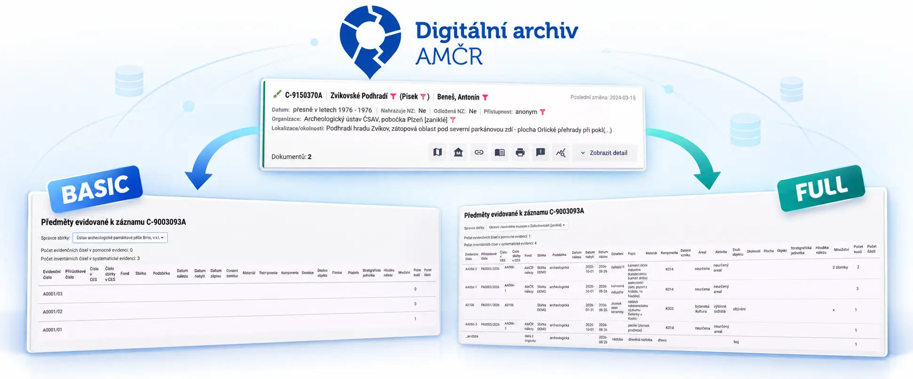
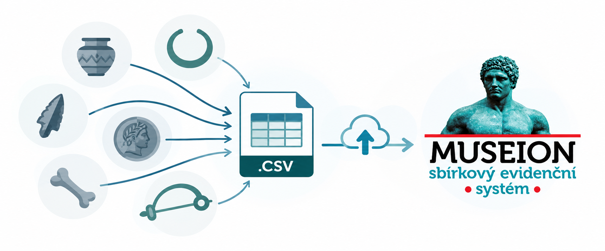
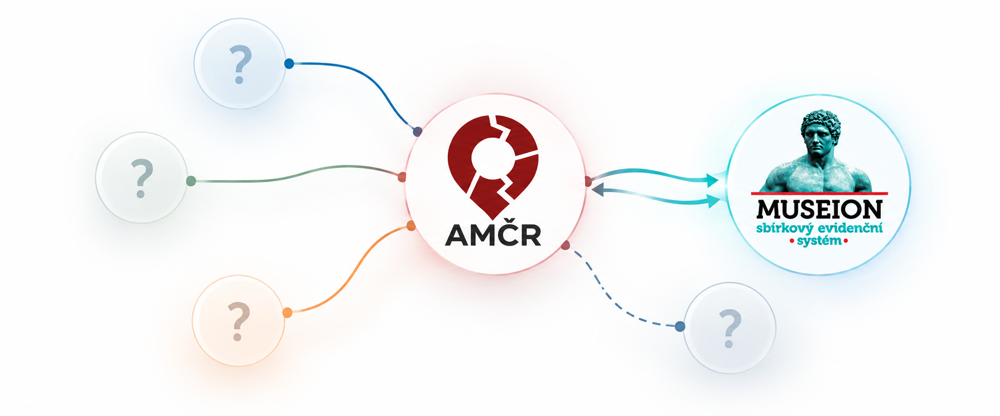

*Muzea pracují s archeologickými daty dvojího druhu: s údaji o výzkumech, které sama provádějí, a s nálezy, které z nich i odjinud přibývají do jejich sbírek. Obojí se ale dosud evidovalo v oddělených systémech – a stejné údaje se tak zapisovaly dvakrát, s větší administrativou i rizikem chyb. V projektu podpořeném programem PRAK SHAPE Akademie věd ČR jsme proto se společností Axiell propojili Archeologickou mapu ČR (AMČR) s nejrozšířenějším muzejním systémem MUSEION. A rozhraní, na kterém propojení stojí, jsme otevřeli i dalším systémům.*

## Jeden nález, jeden zápis

Propojení nefunguje jen jedním směrem. MUSEION do AMČR data posílá, ale také je z ní čte, takže oba systémy mohou zůstat v souladu bez ručního přepisování.
Jednotlivé funkce odpovídají sedmi scénářům, které oba systémy shodně označují S1–S7; v textu je uvádíme v závorce, aby šlo snadno dohledat podrobnosti v dokumentaci.

### Z muzejní evidence rovnou do AMČR-PAS

Zapsaný nález lze z MUSEIONu jedním tlačítkem odeslat do [AMČR-PAS](https://amcr-help.aiscr.cz/amcr/amcr-pas/), modulu pro evidenci samostatných nálezů – jednotlivě i hromadně pro celou skupinu záznamů (S2, S3).
Při exportu si muzeum zvolí, do jakého stavu se záznam v AMČR-PAS zapíše, jakou bude mít přístupnost a které obrazové přílohy se k němu přenesou.
MUSEION pak k předmětu uloží identifikátor nálezu v AMČR a odkazy do AMČR i do Digitálního archivu.

Nálezy zapsané z MUSEIONu se v AMČR chovají stejně jako jakékoli jiné záznamy AMČR-PAS.

> *Vybraný záznam nebo celou skupinu záznamů z MUSEION lze snadno odeslat do AMČR-PAS.*

### Inventární číslo, které se samo doplní

Zápis nálezu do muzejní evidence obvykle probíhá ve dvou krocích: nejprve dostane v pomocné evidenci dočasné evidenční číslo, teprve po zařazení do sbírky trvalé číslo inventární.
Dosud se pak musel údaj v AMČR opravit ručně.
Nově stačí v MUSEIONu spustit aktualizaci – i hromadně – a nové číslo se do AMČR propíše samo, dohledatelně v historii záznamu.

Aby to šlo, AMČR nově rozlišuje organizaci, pod jejímž projektem byl nález zapsán, a organizaci, které byl nález skutečně předán.
Muzeum, v jehož sbírce nález skončil, s ním tak může pracovat, i když není původcem projektu.

### Údaje z AMČR bez přepisování

Propojení funguje i opačně (S4, S5).
Stačí u předmětu v MUSEIONu uvést identifikátor samostatného nálezu nebo archeologické akce z AMČR a na evidenční kartu lze načíst vybrané údaje – například o lokalitě, okolnostech a dataci nálezu, u samostatných nálezů z AMČR-PAS i fotografie.
Údaje o okolnostech nálezu či výzkumu se tak už nemusí opisovat ručně.

### Kde nálezy skončily

V [Digitálním archivu AMČR](https://digiarchiv.aiscr.cz/) si u projektu, akce či samostatného nálezu nově zobrazíte, ve kterých napojených muzeích jsou související předměty uloženy a pod jakými čísly (S6).
Údaje se načítají na vyžádání, přímo ze sbírkové evidence muzea; filtr navíc najde všechny záznamy, které vazbu na muzejní sbírku mají.
Jak na to, popisuje [tutoriál v nápovědě AMČR](https://amcr-help.aiscr.cz/digiarchiv/museion.html).

O rozsahu sdílení přitom **rozhoduje muzeum**, a to u každého záznamu zvlášť: buď poskytne jen evidenční či inventární číslo (úroveň BASIC), nebo i vybrané odborné údaje (úroveň FULL).
Místo uložení předmětu ani jeho ocenění se nesdílí nikdy a fotografie se touto cestou nepřenášejí.
Poskytování údajů upravuje jednoduchá bezúplatná dohoda mezi muzeem a ARÚ, jejíž [vzor je ke stažení](https://amcr-help.aiscr.cz/metodika/dohody.html#vzory-dokumentů-ke-stažení) v nápovědě AMČR.
ARÚ údaje o předmětech trvale nepřebírá a vždy je zobrazuje s uvedením muzea jako zdroje.

> *U záznamu v Digitálním archivu můžete získat informace o konkrétních předmětech v muzejních sbírkách.*

### Hromadný import z tabulky

Pro větší soubory nálezů nabízí MUSEION nového průvodce hromadným importem (S7).
Pracuje se zjednodušenou tabulkou o 31 údajích, kterou lze naplnit například z podkladů oprávněné archeologické organizace nebo ze starší excelové evidence; původní čísla nálezů se při importu neztratí.
Jednotná tabulka může do budoucna zjednodušit i samotné předávání nálezů do muzejních sbírek.

> *Údaje o sbírkových předmětech lze do MUSEION hromadně importovat formou předvyplněné tabulky.*

### Společný jazyk obou systémů

Aby data mohla bezpečně putovat mezi systémy, musí oba mluvit stejnou řečí (S1).
Každé muzeum si proto jednou propojí své slovníky – předmět, materiál, datace, okolnosti nálezu a další – s hesláři AMČR, které jsou strojově dostupné přes rozhraní OAI-PMH.
Chybí-li u některého hesla vazba, MUSEION na to při exportu upozorní.

## Otevřené dveře pro další systémy

Srdcem propojení je **AMČR-PAS API** – rozhraní, přes které lze do AMČR-PAS zapisovat samostatné nálezy, aktualizovat jejich evidenční čísla a přikládat k nim fotografie.
Rozhraní není vyhrazeno jedinému dodavateli: připojit se může **kterýkoli integrátor**, který pracuje s oprávněným účtem AMČR.
MUSEION je jeho prvním, referenčním klientem.

Rozhraní je popsané v anglické [referenční dokumentaci pro vývojáře](https://arup-cas.github.io/aiscr-api-home/pas-api/) včetně struktury dat, stavových kódů a ukázek v cURL a Pythonu, takže je lze využít i mimo české prostředí.
Hodí se například pro **terénní aplikace pro evidenci nálezů**, které pracují bez stálého připojení a data do AMČR odešlou, až když je připojení k dispozici.

> *Díky pilotnímu projektu propojení MUSEION-AMČR se otevírá cesta pro snadnou integraci AMČR s dalšími systémy.*

## Co bude dál

Integrace je součástí MUSEIONu 5.6 a jeho běžné licence, bez samostatného poplatku.
Obě strany ji ověřily a předaly v červenci 2026 a v produkčním prostředí otestovaly v srpnu.
Na podzim ji budeme společně s Axiellem představovat muzeím – na konferenci Axiell, na regionálních archeologických komisích i na setkáních v jednotlivých krajích – a pomáhat s prvními zapojeními.

Vyvíjíte systém pro správu sbírek nebo terénní aplikaci a chcete se do AMČR-PAS připojit? Ozvěte se nám.

## Shrnutí

- Muzea s MUSEIONem zapisují nálezy do AMČR-PAS jedním tlačítkem, jednotlivě i hromadně, a inventární čísla udržují v obou systémech bez ručních oprav.
- Údaje z AMČR lze načíst přímo na evidenční kartu předmětu, bez přepisování.
- Digitální archiv AMČR ukazuje, ve kterých muzeích jsou nálezy uloženy; o rozsahu sdílení rozhoduje u každého záznamu muzeum.
- AMČR-PAS API je otevřené všem integrátorům, včetně terénních aplikací; MUSEION je jeho referenčním klientem.
- Méně rutinní administrativy a méně chyb z přepisování znamená více času na odbornou práci a péči o archeologické dědictví.
- Projekt byl podpořen programem PRAK SHAPE Akademie věd ČR.

## Chcete vědět víc?

- [AMČR-PAS API – referenční dokumentace pro vývojáře (anglicky)](https://arup-cas.github.io/aiscr-api-home/pas-api/)
- [PAS API – příjem a zpracování záznamů v AMČR (technická dokumentace)](https://aiscr-webamcr.readthedocs.io/cs/latest/05_integrace/pas_api.html)
- [Předměty ve sbírkách muzeí – tutoriál k Digitálnímu archivu AMČR](https://amcr-help.aiscr.cz/digiarchiv/museion.html)
- [Dohody o využívání AMČR – propojení se sbírkovou evidencí muzeí a vzor dohody o sdílení údajů](https://amcr-help.aiscr.cz/metodika/dohody.html#museion)
- [MUSEION: Integrace s AMČR – příručka společnosti Axiell](https://doc.axiell.cz/soubory/prirucky/p33_integrace_amcr.pdf)
- [Blogpost Axiell: Museion a Archeologická mapa ČR – nové možnosti integrace](https://www.axiell.com/cz/blog-post/museion-a-archeologicka-mapa-cr-nove-moznosti-integrace-usnadni-spravu-archeologickych-dat)
- [Novák, D., Sýkora, J. (2025): Možnosti propojení AMČR se systémy pro evidenci a správu sbírek muzejní povahy](https://doi.org/10.5281/zenodo.17370634)
