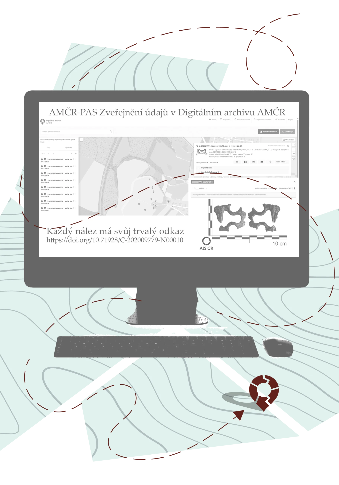
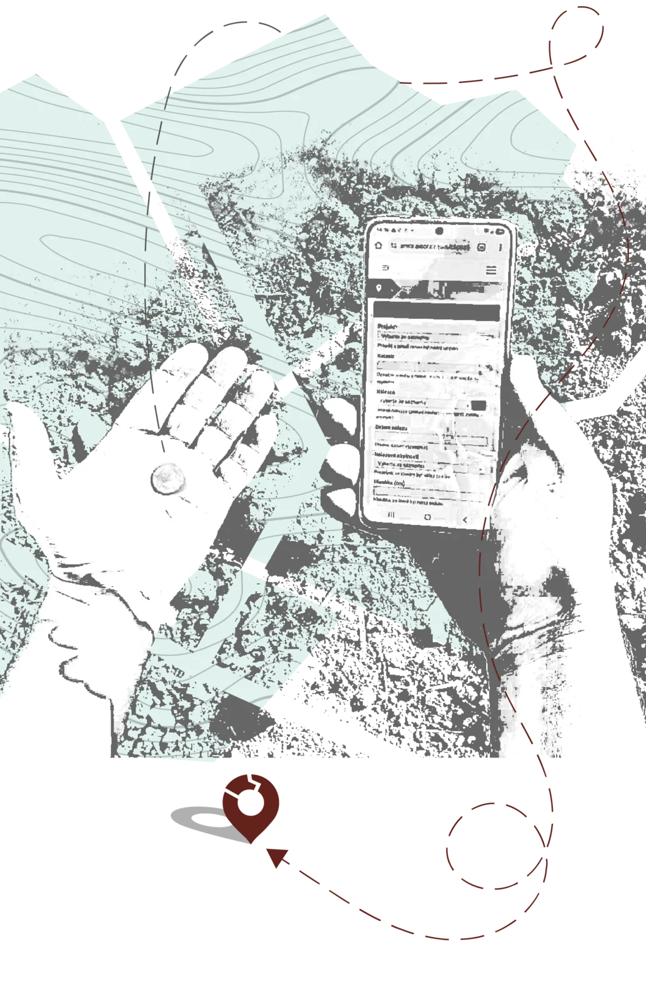

*Museums handle two kinds of archaeological data: records of the excavations they run themselves, and the finds that enter their collections from those excavations and elsewhere. Until now the two lived in separate systems, so the same details were typed in twice – more paperwork, more room for error. In a project supported by the PRAK SHAPE programme of the Czech Academy of Sciences, we worked with Axiell to connect the Archaeological Map of the Czech Republic (AMČR) with MUSEION, the country's most widely used museum collection-management system. And we opened the API behind it to other systems as well.*

## One find, recorded once

The integration works in both directions. MUSEION sends data to AMČR and reads data back from it, so the two systems stay consistent without retyping.
Each function corresponds to one of seven scenarios that both systems number the same way, S1–S7; we give the number in brackets so the details are easy to find in the documentation.

> *How AMČR and MUSEION talk to each other – and where other systems can connect to AMČR-PAS. Bulk import (S7) runs entirely inside MUSEION, so it is not shown.*

### From the museum record straight into AMČR-PAS

A recorded find can be sent from MUSEION to AMČR-PAS, the AMČR module for individual finds, with a single button – one at a time or for a whole group of records (S2, S3).
On export the museum chooses the state the record enters in AMČR-PAS, its access level, and which images travel with it.
MUSEION then stores the find's AMČR identifier and links to AMČR and the Digital Archive.

Finds exported from MUSEION behave like any other AMČR-PAS record.

> *Once archived, AMČR-PAS finds are published in the AMČR Digital Archive according to their access level, each with its own persistent link.*

### Registration numbers that keep up by themselves

A find usually enters a museum's records in two steps: first a temporary number in the auxiliary register, then a permanent inventory number once it joins the collection.
Until now the number in AMČR had to be corrected by hand.
Now MUSEION updates it in AMČR on request – in bulk too – and the change is traceable in the record's history.

To make this possible, AMČR now distinguishes the organisation whose project a find was recorded under from the organisation it was actually handed over to, so the museum holding the find can work with it even if the project is not its own.

### AMČR data without retyping

The link also works the other way (S4, S5).
Give an object in MUSEION the identifier of an AMČR-PAS find or an archaeological event, and selected details – such as the site, find circumstances and dating, plus photographs for AMČR-PAS finds – can be loaded onto its catalogue record.

### Where the finds ended up

In the [AMČR Digital Archive](https://digiarchiv.aiscr.cz/), projects, events and individual finds can now show which connected museums hold related objects, and under which numbers (S6).
The data is retrieved on request, live from the museum's own records, and a filter lists every record linked to a museum collection.

**The museum decides** how much it shares, record by record: only the registration or inventory number (BASIC), or selected descriptive data as well (FULL).
Storage location and valuation are never shared, and no photographs travel this way.
Providing data is covered by a simple, free-of-charge agreement between the museum and the Institute of Archaeology; a [template (Czech)](https://amcr-help.aiscr.cz/metodika/dohody.html#museion) is published in the AMČR help.
The Institute does not keep copies of the object data and always credits the museum as its source.

### Bulk import from a spreadsheet

For larger sets of finds, MUSEION has a new bulk-import wizard (S7).
It works with a simplified 31-field spreadsheet that can be filled from a licensed archaeological organisation's records or an older spreadsheet register, and the original find numbers are kept.

### A shared language

For data to move safely between systems, both have to speak the same language (S1).
Each museum maps its vocabularies – object, material, dating, find circumstances and others – once onto AMČR's controlled vocabularies, which are published machine-readably through OAI-PMH. MUSEION warns on export if a term is still unmapped.

## An open door for other systems

At the core of the integration is the **AMČR-PAS API**: the interface for recording individual finds in AMČR-PAS, updating their registration numbers and attaching photographs.
It is not reserved for a single vendor. **Any integrator** working with an authorised AMČR account can connect, and MUSEION is its first, reference client.

The [developer reference](https://arup-cas.github.io/aiscr-api-home/pas-api/) documents the endpoints, the XML element contract, status codes, rate limits and retries, with worked examples in cURL and Python.
The API is a natural fit for **offline field applications for recording finds**, which collect data without a connection and submit it once one is available.

> *Recording a find in the field. Apps from other developers can write to AMČR-PAS the same way.*

## What comes next

The integration ships with MUSEION 5.6 as part of its standard licence, at no extra charge.
It was verified and handed over in July 2026 and tested end to end in production in August.
This autumn we will present it to museums together with Axiell and support the first institutions as they connect.

Building a collection-management system or a field app and want to connect to AMČR-PAS? Get in touch.

## Summary

- Museums using MUSEION record finds in AMČR-PAS with one button, singly or in bulk, and keep registration numbers in step without manual fixes.
- AMČR data can be loaded straight onto a catalogue record, without retyping.
- The AMČR Digital Archive shows which museums hold the finds; each museum decides, record by record, how much it shares.
- The AMČR-PAS API is open to any integrator, including field apps; MUSEION is its reference client.
- The project was supported by the PRAK SHAPE programme of the Czech Academy of Sciences.

## Want to know more?

- [AMČR-PAS API – developer reference](https://arup-cas.github.io/aiscr-api-home/pas-api/)
- [AMČR API – OAI-PMH, File API and authentication](https://arup-cas.github.io/aiscr-api-home/)
- [PAS API – processing in AMČR (technical documentation, Czech)](https://aiscr-webamcr.readthedocs.io/cs/latest/05_integrace/pas_api.html)
- [MUSEION: Integration with AMČR – Axiell manual (Czech)](https://doc.axiell.cz/soubory/prirucky/p33_integrace_amcr.pdf)
